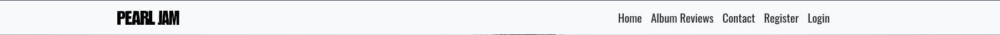
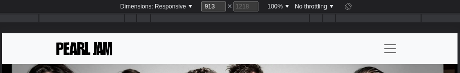
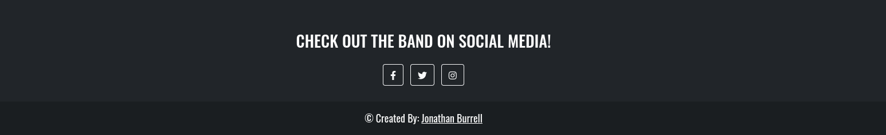
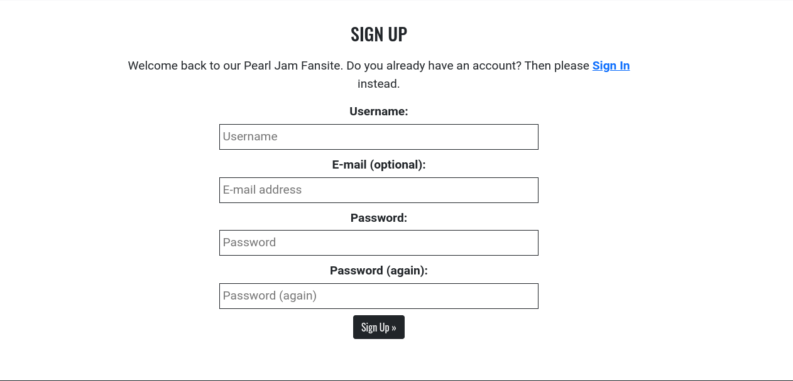

# JB's Pearl Jam Fan Site

This Pearl Jam Fan Site was designed as a resource to help people to learn about the American rock band, Pearl Jam. The site is targeted towards users who want to learn about the band, find out when their upcoming concerts are taking place, as well as read aggregated reviews of the band's albums. Users can create an account on the site, if they want to join the discussion on the band's albums, as well as contact the fan club through the Contact form.

The live link can be found here - [Pearl Jam Fansite](https://pearljam-fansite.herokuapp.com/)

This screenshot displays the site in browsers of various widths:

## User Experience (UX)

A visitor to this site could be either an existing fan of the band Pearl Jam, or someone that's interested in the group and wants to learn more about the band's history, upcoming concerts and the albums that they've released through their career.

### User Stories

#### Site Admin functions

- As a site admin I can create, update and delete album reviews from the admin panel so that I can manage my site content.
- As a site admin I can create draft posts so that I can publish them later.
- As a site admin I can manage the interactive site content from the admin panel so that I can control the content left by registered site users.
- As a site admin I can update and delete registered users so that I can manage the users that have registered on the site.

#### Site User Functions

- As a site user I can immediately understand the purpose of the site so that I can learn information about the group.
- As a Site User, I can navigate around the site so that I can find content that's relevant to the purpose of the website.
- As a site user I can view a list of album reviews on an "Album Reviews" page so that I can read these reviews.
- As a site user I can reach out to the band fan club so that I can engage with them and find out more info.
- As a site user I can have the option to visit the band's social media accounts so that I can learn more about them and their current activities.
- As a site user I can create an account so that I can be a registered user, and post comments on the site.
- As a site user I can log in, register for an account, or log out of my account as appropriate so that I can comment on the album reviews in the site.
- As a site user I can view a page of reviews with pagination so that I can read all the album reviews.
- As a site user I want to be able to comment on each album review so that I can express my view and start a conversation on the site content.
- As a site admin or site user I can view all existing comments left by me and other users so that I read the conversation and the views of myself and others.

#### User stories not yet implemented

The following user stories were scoped out of the project due to time constraints and labelled as "Won't Have" on the project board on Github. It is intended that these user stories will be implemented at a later date. 

- As a site user I can verify my site membership through an email confirmation so that I can provide extra approval for my site membership.
- As a site user I can manage my user profile so that I can add information about myself.
- As a site user I can recover or reset my password so that I can gain access to the logged-in features if I have forgotten my login details.

### Site Design

The site uses a simple and clean design which sticks to minimalistic colours and design thinking. There's a single static image on the site homepage (the homepage banner) along with one image to represent each of the group's albums. The site uses alternating white and dark sections in the homepage to make it easier for the user to identify each section individually.

#### Wireframes

 
Homepage

Album Reviews Page

Contact page

## Agile Methodology

Github Projects was used to manage the development requirements and process. There's a link to the project board [here](https://github.com/users/JBurrellIRL/projects/2) .

A Github Issue was created for each User Story at the start of the project. The User Stories each contain Acceptance Criteria, to make it more clear as to when each User Story has been completed.

## Project Data Model
To create this project, I used Django's Class-Based and Function-Based views. 

Individual views were used to render the homepage, the Album Review landing page and the Review Detail page (which is seen after clicking on an individual album). 

Separate views were also created to allow registered users to update their own comments and to delete their own comments.

For the site administrator to create album reviews, a custom album review model was required and created. A Comment model was also required to allow users to comment on each album review.

For user authentication, I used Django AllAuth.

## Testing

Testing and results can be found [here](https://github.com/JBurrellIRL/ProjectFour/blob/main/TESTING.md) .

### User Authentication

- An important part of this review site is to ensure that only users can only edit and delete their own comments. 
- I used the Django "LoginRequired" mixin to ensure that anyone trying to access a secure page (such as a direct URL to the page used to edit a comment) are redirected to the login page.  
- Django's "UserPassesTest" mixin is used to limit access based on permissions i.e. to ensure that users can only edit/delete comments for which they are the author. If the user tries to edit a comment of which they are not the author, they are shown an HTTP 403 Forbidden error.

### Form Validation
If invalid or empty data is submitted through a form or comment box on the site, the form will not submit and the browser will return an error to inform the user that valid data must be passed for the submission to be successful. This has been tested in multiple browsers.

### Security
The database URL and secret key needed to access the database are stored as environment variables in the env.py file. This was set up prior to pushing to GitHub to ensure that this data isn't compromised.

Cross-Site Request Forgery (CSRF) tokens were used on all forms throughout this site, to ensure the integrity of the forms. 

## Site Features

### Header

**Logo**
- The band logo is positioned in to the left of the website navigation bar, and links back to the homepage for ease of use. The logo image was obtained from [this website](https://stickpng.com/img/icons-logos-emojis/artist-logos/pearl-jam-logo).

**Navigation Bar**

- The navigation bar is positioned at the top of each page in the site, and includes links to all pages within the site.
- The navigation bar items display differently depending on whether or not the site visitor is logged in. 
- If the visitor is logged out, they'll see an option to either register for an account or to log into an existing account:

- If the visitor has logged in or registered, the options to register or log in are replaced by a user icon (from Font Awesome) and their username. Clicking on the username opens a dropdown menu, where the user has an option to Logout.

- The navigation bar uses Bootstrap classes and is fully responsive to screens of different sizes. It switches to a "hamburger" menu at 992px:

- The navigation items change to a lighter colour on hover.

### Footer

- The site footer includes links to the band's Twitter, Facebook and Instagram pages.
- The links are coded to open in a new browser tab, so that the visitor is not taken away from the website.
- There's also a reference to me as the site designer, along with a link to my personal website.

### Home Page

**Banner image**

- The homepage includes a banner (hero) image at the top of the page, which is a picture of the group itself. This image is responsive to screens of different sizes.

**About section**

- The "About Pearl Jam" section of the homepage has a blurb to give the user a brief history of the band. 

**Upcoming Tour Dates section**

- This section has a list of some upcoming tour dates, that give the date, city and concert venue, which is useful to both new and existing fans of Pearl Jam. 

**Album Streams section**

- This section has some of the group's most popular albums, embedded from Spotify. This is also useful to both new and existing fans of the band.

### User Account Pages

**Sign Up**

**Log In**

**Log Out**

- I used the django-allauth package to create the Sign up, Log in and Log out functionality.
- The user receives messages in their browser to confirm whether or not their login attempt has been successful. They also receive notifications if they've made an error in one of the sign-up or login fields.

### Album Reviews page

- This page shows a list of posts, one represeting each album released by the group. Each post includes a post thumbnail, the title of the album, the date of release and an excerpt of the main post content
- The reviews are paginated after 9 posts, and can be navigated througn the "Next" and "Previous" tabs to the bottom of the main grid display. 
- Clicking on either the post thumbnail image or the post title will take the user to the main content page for that review.

### Review Detail Page

- The main detail page shows the post thumbnail aligned to the left of the container, with the album Title, release date and record producer to the right of the container. 
- In the main text area, the visitor can read an overview of the album, plus selected professional reviews of the album.

**Comments Section**

- The comments section lists all comments left by users for that particular album review.
- If nobody has left a comment yet, a message stating "No Comments yet..." is shown.
- For logged-out users, an option to Sign In or Register is visible. This is not shown to users that are logged in.
- Comments can only be left by a user that's created an account and logged in successfully.
- A logged-in user also has options to Edit or Delete their comments. They can only edit/delete comments left by themselves, not by other users.
    

- The user receives browser messages to confirm that they've posted a comment, edited a comment and/or deleted a comment.
- If a logged-out user obtains the direct URL to the page to edit a comment, they're redirected to the "Sign In" screen.
- If they then log in under a different username, they receive a "401 Forbidden" browser message.

### Contact page

- The user can click on the "Contact Us" option in the navigation bar to be taken to a contact form, which lies on a separate page. The user can fill out the fields - they receive a message to confirm that their message has been sent, and a message is then sent to the site administrator. 

### Future Features

Some user stories were scoped out of the project for now, due to time constraints. These are listed under the "Future Features" column in GitHub Projects. It's intended that these will be developed in the future at a later date.

- As a site user I can recover or reset my password so that I can gain access to the logged-in features if I have forgotten my login details.
- As a site user I can verify my site membership through an email confirmation so that I can provide extra approval for my site membership.
- As a site user I can manage my user profile so that I can add information about myself.

## Deployment - Heroku

This app was deployed to Heroku using the following steps:

### Create the Heroku App:

- Log in to [Heroku](https://dashboard.heroku.com/apps) or create an account.
- Click the button labelled New in the top right-hand corner and from the drop-down menu select "Create New App".
- Enter a unique app name that fits your project.
- Select your region.
- Click on the Create App button.

### Attach the Postgres database:
- In the Resources tab, under the Add-Ons heading, type in Postgres and select the Heroku Postgres option.
- Copy the DATABASE_URL located in Config Vars in the Settings Tab.

### Connect the PostGres database and Cloudinary to project
- Create an env.py file in the main directory of the project.
- Add the DATABASE_URL value and your chosen SECRET_KEY value to the env.py file. 
- Import the env.py file to the settings.py file and add the SECRETKEY and DATABASE_URL file paths.
- Comment out the default database configuration.
- Save files and make migrations.
- Add Cloudinary URL to env.py.
- Add the cloudinary libraries to the list of installed apps in the settings.py file.
- Add the STATIC files settings to the settings.py file. 
- Link the file to the templates directory in Heroku.
- Change the templates directory to TEMPLATES_DIR.
- Add Heroku to the ALLOWED_HOSTS list the format [e.g. for my project 'pearljam-fansite.herokuapp.com', 'localhost'].

### Create files / directories
- Create a requirements.txt file
- Create three directories in the main directory; media, static and templates.
- Create a file named "Procfile" in the main directory and add the following: web: gunicorn project-name.wsgi

### Update Heroku Config Vars
Add the following Config Vars in Heroku:
- SECRET_KEY: value 
- CLOUDINARY_URL: value
- PORT = 8000
- DISABLE_COLLECTSTATIC = 1

### Deploy
- Set Debug to False in prject settings.py
- Go to the deploy tab on Heroku and connect to GitHub, then to the required repository. 
- Scroll to the bottom of the deploy page and either click Enable Automatic Deploys for automatic deploys or Deploy Branch to deploy manually. Manually deployed branches will need re-deploying each time the repo is updated.
- Click View to view the deployed site.

The site is now live and operational.

## Forking this repository
- Locate the repository at this link [Pearl Jam Fansite](https://github.com/JBurrellIRL/ProjectFour).
- At the top of the repository, on the right side of the page, select "Fork" from the buttons available. 
- A copy of the repository is now created.

## Cloning this repository
To clone this repository follow the below steps: 

1. Locate the repository at this link [Pearl Jam Fansite](https://github.com/JBurrellIRL/ProjectFour). 
2. Under **'Code'**, see the different cloning options, HTTPS, SSH, and GitHub CLI. Click the prefered cloning option, and then copy the link provided. 
3. Open **Terminal**.
4. In Terminal, change the current working directory to the desired location of the cloned directory.
5. Type **'git clone'**, and then paste the URL copied from GitHub earlier. 
6. Type **'Enter'** to create the local clone. 

## Languages

- Python
- HTML
- CSS
- Javascript

## Frameworks, libraries, programs used during development
- [Django](https://www.djangoproject.com/): Main python framework used in the development of this project.
- [Django-allauth](https://django-allauth.readthedocs.io/en/latest/installation.html): authentication library used to create the user accounts.
- [Python Decouple](https://pypi.org/project/python-decouple/): used for storage of certain sensitive login details.
- [Django SES](https://github.com/django-ses/django-ses): email back-end for Django, used in the contact form.
- [PostgreSQL](https://www.postgresql.org/) was used as the database for this project.
- [Heroku](https://heroku.com) - Cloud-based platform used for deployment of project.
- [Google's Mobile Responsiveness Test](https://search.google.com/test/mobile-friendly) - Used to verify responsiveness of website on different devices.
- [Am I Responsive](https://ui.dev/amiresponsive) - Mobile responsive test.
- [Balsamiq](https://balsamiq.com/) - Used to generate Wireframe images at the start of the project.
- [Chrome Dev Tools](https://developer.chrome.com/docs/devtools/) - Used for overall development and tweaking, including testing responsiveness and performance.
- [Font Awesome](https://fontawesome.com/) - Used for the logged-in user icon in navigation bar.
- [GitHub](https://github.com/) - Used for project version control and project user stories.
- [Google Fonts](https://fonts.google.com/) - Custom fonts in the project.
- [W3C](https://www.w3.org/) - HTML and CSS vaidation.
- [PEP8 Online](http://pep8online.com/) - Python validation.
- [Jshint](https://jshint.com/) - JavaScript validation.
- [Summernote](https://summernote.org/): A WYSIWYG editor used for the album review posts.
- [Crispy Forms](https://django-crispy-forms.readthedocs.io/en/latest/): Used to manage Django forms in the project.
- [Cloudinary](https://cloudinary.com/): image hosting platform for the project.
- [Bootstrap 5](https://getbootstrap.com/docs/5.0/getting-started/introduction/): CSS framework for mobile-responsiveness and styling.
- [Markdown Tables Generator](https://www.tablesgenerator.com/markdown_tables): used to generate the tables in the TESTING.md file.

## Credits

- [W3Schools](https://www.w3schools.com/)
- [Django Docs](https://docs.djangoproject.com/en/4.1/releases/3.2/)
- [Bootstrap 5.0 Docs](https://getbootstrap.com/docs/5.0/getting-started/introduction/)
- [Stack Overflow](https://stackoverflow.com/)
- [Wikipedia](https://www.wikipedia.org/): Album review text content was taken from Wikipedia articles and credited in each post. No copyright infringement is intended whatsoever.
- [Discogs](https://www.discogs.com): Album cover images were obtained from here. No copyright infringement is intended.
- [Geeks for Geeks](https://www.geeksforgeeks.org/class-based-generic-views-django-create-retrieve-update-delete/) - for help with class-based views.
- [Code Institute - Blog Walkthrough Project](https://github.com/Code-Institute-Solutions/Django3blog)
- [Udemy](https://www.udemy.com/course/python-and-django-full-stack-web-developer-bootcamp/) - a Udemy course I am taking in parallel to the Code Institute course.
- [Ordinary Coders](https://ordinarycoders.com/blog/article/build-a-django-contact-form-with-email-backend) - For help with contact form view and AWS storage option for form.

## Acknowledgments

- Thanks a lot to my mentor, Jack Wachira, for his advice and help during our mentor sessions. 
- Thanks also to Code Institute's Christine Kelley for the sharing of helpful resources that were invaluable when creating this project.
