# Testing Document

## User Story Testing

#### Site Admin functions

- *As a site admin I can create, update and delete album reviews from the admin panel so that I can manage my site content.*

- The site administrator has full access to CRUD functionality for all album reviews and comments from within the site admin panel. 

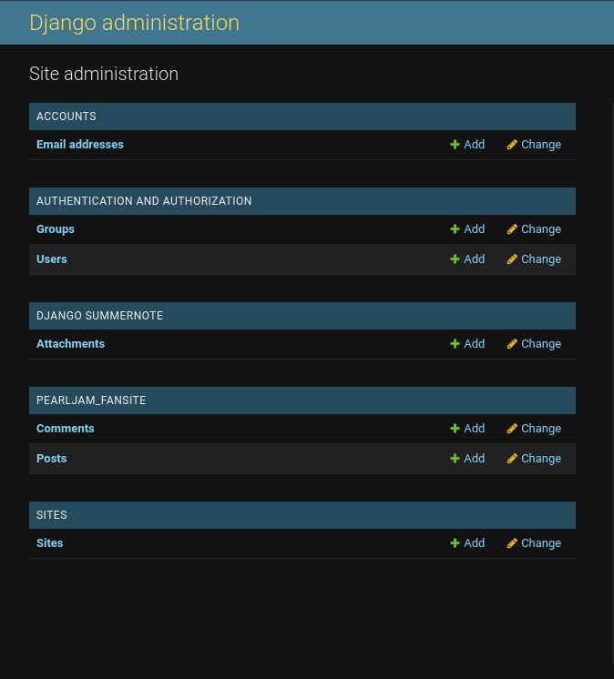

- *As a site admin I can create draft posts so that I can publish them later.*

The site administrator can create a post and set it to either "Draft" or "Published" as required.

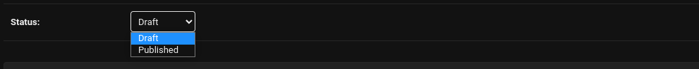

- *As a site admin I can manage the interactive site content from the admin panel so that I can control the content left by registered site users.*

The site administrator can manage comments left by users from the admin panel. They can delete them or even edit them if they desire.

- *As a site admin I can update and delete registered users so that I can manage the users that have registered on the site.*

The site administrator can delete registered users as required, and can also update their user profiles from the back-end. I plan to build a user-facing functionality in future to allow users to update their own profiles, as mentioned in the README.md file.

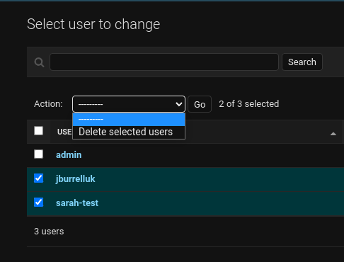

#### Site User Functions

- *As a site user I can immediately understand the purpose of the site so that I can learn information about the group.*

The site homepage allows the visitor to learn about the history of the group, learn about when they're next playing live gigs, and also to listen to albums released by the group. This functionality fulfills this user story.

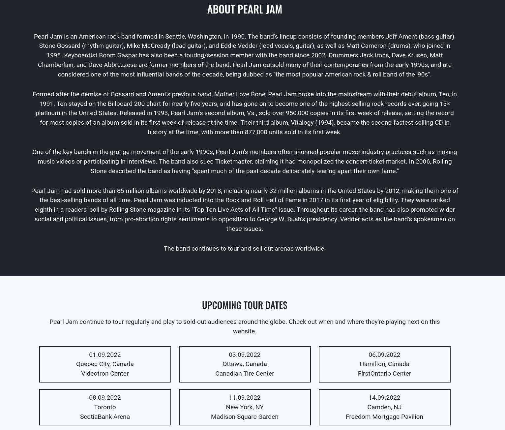

- *As a Site User, I can navigate around the site so that I can find content that's relevant to the purpose of the website.*

The site visitor can navigate around the site content by using the navigation bar that appears at the top of the site. The navigation bar allows the user to navigate through the site pages, as well as to register, login and log out of their user account.

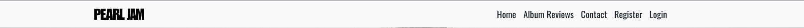

- *As a site user I can view a list of album reviews on an "Album Reviews" page so that I can read these reviews.*

The user can click on the "Album Review" navigation item in order to view this content. They can read a review excerpt on the Album Review landing page and then click into a review of their choice to read more:

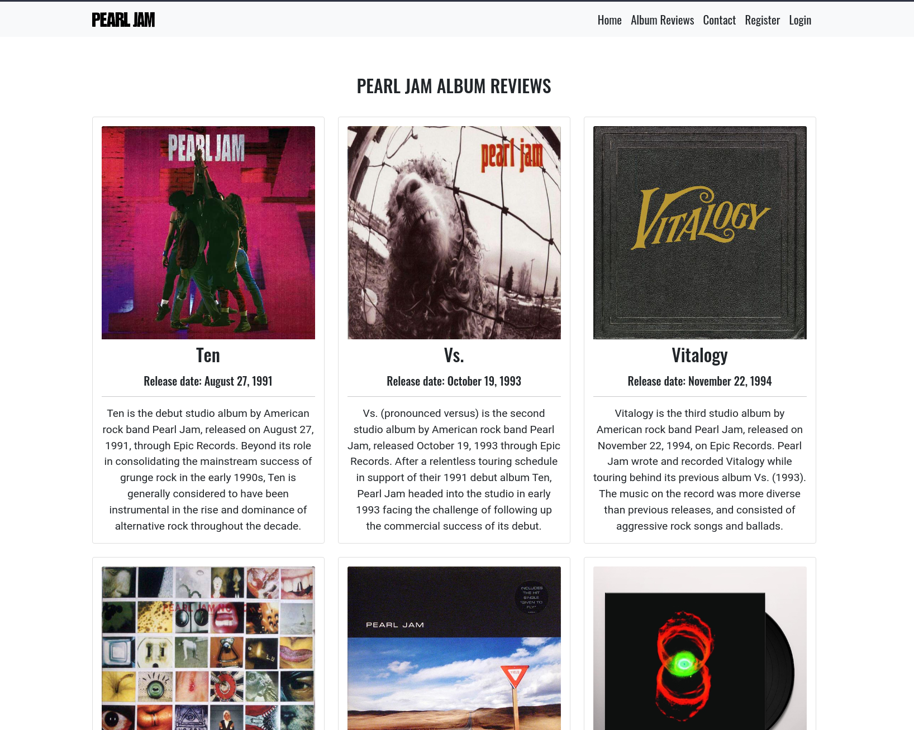

- *As a site user I can reach out to the band fan club so that I can engage with them and find out more info.*

The user can click on the "Contact" navigation item, to be brought to a Contact form. The details submitted through the Contact form are sent to the email address specified as the storage method by the website administrator.

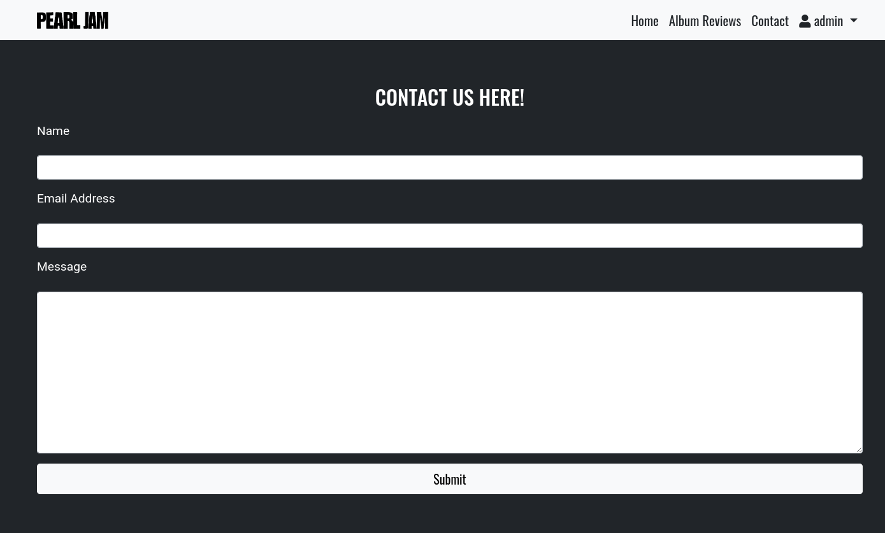

- *As a site user I can have the option to visit the band's social media accounts so that I can learn more about them and their current activities.*

Social media account links have been added to the footer area of the site, that link to the band's official social media channels. The links open in a new tab, so that the user avoids having to navigate entirely away from the site:

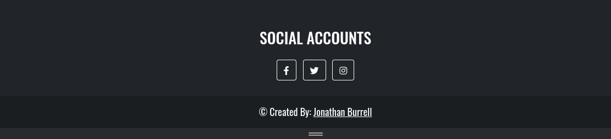

- *As a new site user I can create an account so that I can be a registered user, and post comments on the site.*

The site user can click on the "Register" option contained in the navigation bar, which then takes them to an account creation page. Once the account is created, they can post comments within the review detail page comment box:

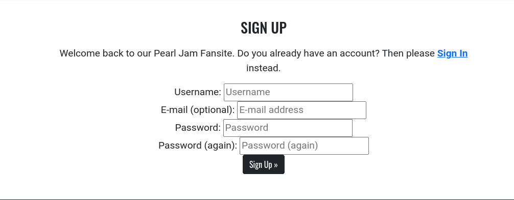

- *As a registered site user I can log in or log out of my account as appropriate so that I can comment on the album reviews in the site.*

The site user has an option to log in, if they are logged out, or to log out if they are logged in. Once logged in, they have the capability to post comments on the album reviews.

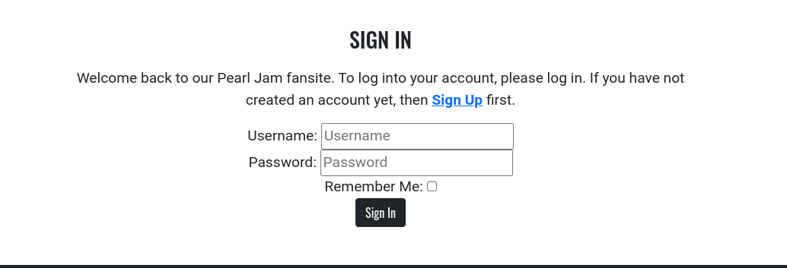

-*As a site user I can view a page of reviews with pagination so that I can read all the album reviews.*

The user views 6 posts at a time on the Album Reviews page. To view the second page of posts, they can click on the "Next" button, which changes to "Prev" when the user is on page 2 of reviews:

- *As a site user I want to be able to comment on each album review so that I can express my view and start a conversation on the site content.*

The site user has the option to post comments on each album review, once they've either logged in or registered. Their comment appears immediately after it's been submitted, and can be seen by both logged-in and logged-out users:

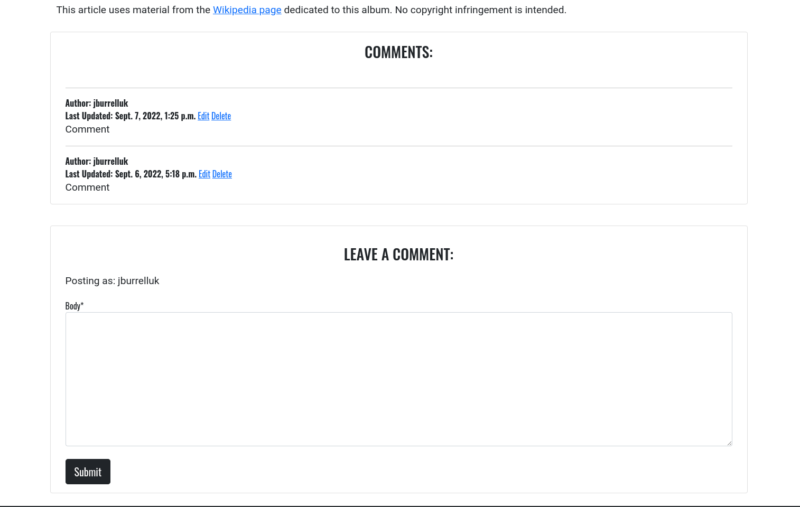

- *As a site admin or site user I can view all existing comments left by me and other users so that I read the conversation and the views of myself and others.*

Comments left by users can be seen by the site admin in the admin panel and on the live site, and also by both logged-in and logged-out users on the live site. 

### Lighthouse Test Results

These tests were conducted using the Lighthouse tool in Google Chrome Developer Tools, to check page performance, accessibility, best practices and SEO. I ran separate tests for both mobile and desktop. 

#### Mobile

| Page           | Performance | Accessibility | Best Practices | SEO |
|----------------|-------------|---------------|----------------|-----|
| Home           | 94          | 98            | 100            | 100 |
| Album Reviews  | 94          | 98            | 100            | 100 |
| Reviews Detail | 94          | 98            | 100            | 92  |
| Contact        | 95          | 100           | 100            | 100 |
| Register       | 95          | 100           | 100            | 100 |
| Sign In        | 94          | 100           | 100            | 98  |
| Sign Out       | 95          | 100           | 100            | 100 |
| Update Comment | 95          | 98            | 100            | 100 |
| Delete Comment | 95          | 98            | 100            | 100 |

#### Desktop

| Page           | Performance | Accessibility | Best Practices | SEO |
|----------------|-------------|---------------|----------------|-----|
| Home           | 97          | 98            | 100            | 100 |
| Album Reviews  | 99          | 98            | 100            | 100 |
| Reviews Detail | 99          | 98            | 100            | 90  |
| Contact        | 100         | 100           | 100            | 100 |
| Register       | 100         | 100           | 100            | 100 |
| Sign In        | 100         | 100           | 100            | 100 |
| Sign Out       | 99          | 100           | 100            | 100 |
| Update Comment | 100         | 99            | 100            | 100 |
| Delete Comment | 99          | 98            | 100            | 100 |

## Manual Testing

### Site Navigation

**Desktop**

| Element          | Action  | Expected Outcome                 | Pass/Fail |
|------------------|---------|----------------------------------|-----------|
| Navigation Bar   |         |                                  |           |
| Navigation Links | Hover   | Font lightens on hover           | Pass      |
| Site Logo        | Click   | Returns to homepage              | Pass      |
| Home             | Click   | Returns to homepage              | Pass      |
| Album Reviews    | Click   | Opens Album Reviews page         | Pass      |
| Contact          | Click   | Opens Contact page               | Pass      |
| Register         | Click   | Opens Registration Page          | Pass      |
| Login            | Click   | Opens Login Page                 | Pass      |
| User dropdown    | Click   | Opens dropdown menu              | Pass      |
| Register         | Display | Doesnt show if user is logged in | Pass      |
| Login            | Display | Doesnt show if user is logged in | Pass      |
| User dropdown    | Display | Doesnt show if user is logged in | Pass      |

**Mobile**

| Element        | Action  | Expected Outcome                                 | Pass/Fail |
|----------------|---------|--------------------------------------------------|-----------|
| Navigation Bar |         |                                                  |           |
| Hamburger menu | Display | Appears when screen reduces to medium breakpoint | Pass      |
| Site Logo      | Tap     | Returns to homepage                              | Pass      |
| Home           | Tap     | Returns to homepage                              | Pass      |
| Album Reviews  | Tap     | Opens Album Reviews page                         | Pass      |
| Contact        | Tap     | Opens Contact page                               | Pass      |
| Register       | Tap     | Opens Registration Page                          | Pass      |
| Login          | Tap     | Opens Login Page                                 | Pass      |
| User dropdown  | Tap     | Opens dropdown menu                              | Pass      |
| Register       | Display | Doesnt show if user is logged in                 | Pass      |
| Login          | Display | Doesnt show if user is logged in                 | Pass      |
| User dropdown  | Display | Doesnt show if user is logged in                 | Pass      |

### Album Reviews Page

| Element           | Action  | Expected Outcome                                                   | Pass/Fail |
|-------------------|---------|--------------------------------------------------------------------|-----------|
| Album Review      | Display | Display thumbnail image, title, release date and excerpt of review | Pass      |
| Thumbnail image   | Click   | Takes user to full album review                                    | Pass      |
| Review Title      | Click   | Takes user to full album review                                    | Pass      |
| Page pagination   | Display | Page will show 6 reviews at a time                                 | Pass      |
| Pagination button | Click   | Takes user backwards and forwards to sub-pages                     | Pass      |

### Album Review Detail Page

| Element                          | Action      | Expected Outcome                                                               | Pass/Fail |
|----------------------------------|-------------|--------------------------------------------------------------------------------|-----------|
| Page content                     | Display     | Display album title, release date, producer, album review and comments section | Pass      |
| Comments section                 | Display     | Display “No Comments Yet” message if no comments have been posted              | Pass      |
| Comments section                 | Display     | Display comments box under album review, with option to Submit a new comment   | Pass      |
| Comments section                 | Display     | Comment box only appears to logged-in user and not to logged-out user          | Pass      |
| Comments section                 | Display     | Options to log in and register appear only to logged-out users                 | Pass      |
| Comment box                      | Leave empty | Browser returns error message and field won’t submit                           | Pass      |
| Comment box                      | Input text  | Comment is successfully posted                                                 | Pass      |
| Comments section                 | Display     | Newly submitted comment is visible to user                                     | Pass      |
| Comments section                 | Display     | Comments area shows username and date comment was last modified/created        | Pass      |
| Comments section                 | Display     | Newly submitted comment is visible to other users and logged-out visitors      | Pass      |
| Comments section                 | Display     | Comment box appears for another comment to be left                             | Pass      |
| Comments section – edit button   | Click       | Takes user to edit comment page                                                | Pass      |
| Comments section – delete button | Click       | Takes user to edit comment page                                                | Pass      |

### Edit Comment Page

| Element                   | Action      | Expected Outcome                                                                                                                      | Pass/Fail |
|---------------------------|-------------|---------------------------------------------------------------------------------------------------------------------------------------|-----------|
| Update comment page       | Access      | If a user tries to access this page (through direct url) without being signed in they are redirected to the Login page                | Pass      |
| Update comment page       | Access      | If a different logged-in user tries to access this page for a particular comment (through direct URL) they receieve a forbidden error | Pass      |
| Update comment button     | Click       | Saves comment entered in “Body” box and redirects to review detail page                                                               | Pass      |
| Update comment text field | Leave empty | Browser returns error message and field won’t submit                                                                                  | Pass      |

### Delete Comment Page

| Element                   | Action      | Expected Outcome                                                                                                                      | Pass/Fail |
|---------------------------|-------------|---------------------------------------------------------------------------------------------------------------------------------------|-----------|
| Delete comment page       | Access      | If a user tries to access this page (through direct url) without being signed in they are redirected to the Login page                | Pass      |
| Delete comment page       | Access      | If a different logged-in user tries to access this page for a particular comment (through direct URL) they receieve a forbidden error | Pass      |
| Delete comment button     | Click       | Deletes comment and returns to Review Detail page                                                                                     | Pass      |
| Delete comment text field | Leave empty | Browser returns error message and field won't submit                                                                                  | Pass      |

### Contact Page

| Element      | Action | Expected Outcome                                                                         | Pass/Fail |
|--------------|--------|------------------------------------------------------------------------------------------|-----------|
| Contact form | Submit | Filling out the fields with valid input for each field sends a message to the site admin | Pass      |
| Email field  | Submit | Entering a non-email address returns an error                                            | Pass      |
| Form fields  | Submit | Leaving a form field blank returns an error, and tells the user to fill out the field    | Pass      |

### Authentication pages

#### Registration page

| Element              | Action                         | Expected Outcome                                               | Pass/Fail |
|----------------------|--------------------------------|----------------------------------------------------------------|-----------|
| Registration link    | Click                          | Redirect to signup page                                        | Pass      |
| Username field       | Leave empty                    | Error asking to please fill in this field                      | Pass      |
| Email address field  | Leave empty                    | Optional field, so can proceed                                 | Pass      |
| Email address field  | Insert wrong format            | Error to inform that the input must be an email address        | Pass      |
| Email address field  | Insert duplicate email address | Error to inform that the email address is already registered   | Pass      |
| Password field       | Leave empty                    | Error asking to please fill in this field                      | Pass      |
| Password again field | Leave empty                    | Error asking to please fill in this field                      | Pass      |
| Password again field | Passwords dont match           | Error informing the user that they must use matching passwords | Pass      |
| Sign Up button       | Click (valid input)            | Account created                                                | Pass      |
| Sign Up button       | Click (valid input)            | Redirect to homepage                                           | Pass      |
| Sign Up button       | Click (valid input)            | Success message generated for user                             | Pass      |

#### Login Page

| Element        | Action                   | Expected Outcome                                   | Pass/Fail |
|----------------|--------------------------|----------------------------------------------------|-----------|
| Login Link     | Click                    | Redirect to login page                             | Pass      |
| Username field | Leave empty              | Error asking to please fill in this field          | Pass      |
| Username field | Enter wrong username     | Error stating that the entered details are invalid | Pass      |
| Password field | Leave empty              | Error asking to please fill in this field          | Pass      |
| Password field | Enter incorrect password | Error stating that the entered details are invalid | Pass      |
| Login button   | Click (valid input)      | Login attempt successful                           | Pass      |
| Login button   | Click (valid input)      | Redirect to homepage                               | Pass      |
| Login button   | Click (valid input)      | Success message generated for user                 | Pass      |

#### Logout Page

| Element         | Action                | Expected Outcome                   | Pass/Fail |
|-----------------|-----------------------|---------------------|--------------|-----------|
| Logout Link     | Click                 | Redirect to logout page            | Pass      |
| Sign Out button | Click                 | Logout successful                  | Pass      |
| Sign Out button | Click                 | Redirect to homepage               | Pass      |
| Sign Out button | Click                 | Success message generated for user | Pass      |
| Log Out Link    | Open when logged out  | Redirect to homepage               | Pass      |

## Bugs

