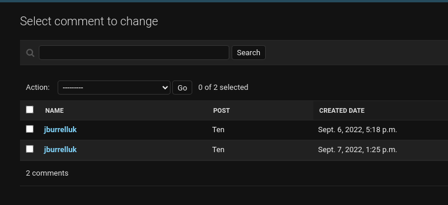
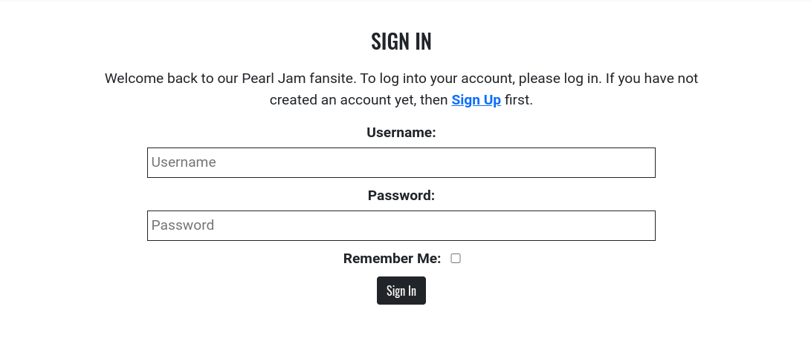

# Testing Document

## User Story Testing

#### Site Admin functions

- *As a site admin I can create, update and delete album reviews from the admin panel so that I can manage my site content.*

- The site administrator has full access to CRUD functionality for all album reviews and comments from within the site admin panel. 

- *As a site admin I can create draft posts so that I can publish them later.*

The site administrator can create a post and set it to either "Draft" or "Published" as required.

- *As a site admin I can manage the interactive site content from the admin panel so that I can control the content left by registered site users.*

The site administrator can manage comments left by users from the admin panel. They can delete them or even edit them if they desire.

- *As a site admin I can update and delete registered users so that I can manage the users that have registered on the site.*

The site administrator can delete registered users as required, and can also update their user profiles from the back-end. I plan to build a user-facing functionality in future to allow users to update their own profiles, as mentioned in the README.md file.

#### Site User Functions

- *As a site user I can immediately understand the purpose of the site so that I can learn information about the group.*

The site homepage allows the visitor to learn about the history of the group, learn about when they're next playing live gigs, and also to listen to albums released by the group. This functionality fulfills this user story.

- *As a Site User, I can navigate around the site so that I can find content that's relevant to the purpose of the website.*

The site visitor can navigate around the site content by using the navigation bar that appears at the top of the site. The navigation bar allows the user to navigate through the site pages, as well as to register, login and log out of their user account.

- *As a site user I can view a list of album reviews on an "Album Reviews" page so that I can read these reviews.*

The user can click on the "Album Review" navigation item in order to view this content. They can read a review excerpt on the Album Review landing page and then click into a review of their choice to read more:

- *As a site user I can reach out to the band fan club so that I can engage with them and find out more info.*

The user can click on the "Contact" navigation item, to be brought to a Contact form. The details submitted through the Contact form are sent to the email address specified as the storage method by the website administrator.

- *As a site user I can have the option to visit the band's social media accounts so that I can learn more about them and their current activities.*

Social media account links have been added to the footer area of the site, that link to the band's official social media channels. The links open in a new tab, so that the user avoids having to navigate entirely away from the site:

- *As a new site user I can create an account so that I can be a registered user, and post comments on the site.*

The site user can click on the "Register" option contained in the navigation bar, which then takes them to an account creation page. Once the account is created, they can post comments within the review detail page comment box:

- *As a registered site user I can log in or log out of my account as appropriate so that I can comment on the album reviews in the site.*

The site user has an option to log in, if they are logged out, or to log out if they are logged in. Once logged in, they have the capability to post comments on the album reviews.

-*As a site user I can view a page of reviews with pagination so that I can read all the album reviews.*

The user views 6 posts at a time on the Album Reviews page. To view the second page of posts, they can click on the "Next" button, which changes to "Prev" when the user is on page 2 of reviews:

- *As a site user I want to be able to comment on each album review so that I can express my view and start a conversation on the site content.*

The site user has the option to post comments on each album review, once they've either logged in or registered. Their comment appears immediately after it's been submitted, and can be seen by both logged-in and logged-out users:

- *As a site admin or site user I can view all existing comments left by me and other users so that I read the conversation and the views of myself and others.*

Comments left by users can be seen by the site admin in the admin panel and on the live site, and also by both logged-in and logged-out users on the live site. 

